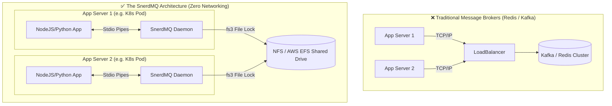

<div align="center">
  <h1>🚀 SnerdMQ</h1>
  <p>A lightning-fast, polyglot background job queue daemon powered by Rust.</p>

  [](https://crates.io/crates/snerdmq)
  [](https://github.com/greyhands2/snerdmq/blob/main/LICENSE)
  [](https://github.com/greyhands2/snerdmq/actions)

</div>

`snerdmq` is a specialized, embedded sidecar daemon that handles all the complex logic of background job queues (polling, file locking, retries, dead-letter queues) in highly-optimized Rust, while letting you write the actual execution logic natively in **Node.js, Python, Go, Ruby, PHP, Java, or C#**.

It runs as a child process and communicates via incredibly simple JSON over standard I/O pipes.

## ✨ Features
- **Zero Networking**: No ports, no firewalls, no IP addresses to configure.
- **Polyglot Friendly**: Works natively with any language that can spawn a child process.
- **Bulletproof Durability**: Uses `fs3` OS-level file locking to ensure 100% ACID compliance and corruption-free storage.
- **Smart Retries**: Built-in exponential backoff and Dead Letter Queue (DLQ) support.
- **Microsecond Latency**: Built on Tokio for massive concurrency with zero CPU hogging.

## 📦 Installation

**Option 1: Cargo (For developers with Rust installed)**
```bash
cargo install snerdmq
```

**Option 2: Pre-compiled Binaries (For production servers)**
Simply download the appropriate binary for your OS from the [GitHub Releases](https://github.com/greyhands2/snerdmq/releases) page and place it in your project.

---

## ⚡ How it Works (The Architecture)

Traditional message brokers (Kafka, Redis, RabbitMQ) force you to manage external servers, configure complex networking, and suffer from TCP latency on every single job execution. 

**SnerdMQ eliminates the network entirely.** It runs as a lightweight child process attached directly to your application container, communicating via 0-latency STDIN/STDOUT pipes.



## 🌍 Distributed Scaling (Kubernetes / EC2)

`snerdmq` is incredibly simple to run on a single machine. But what if you have 10 microservices running behind a load balancer?

By default, `snerdmq` stores its queue in a local file at `.snerdata/tasks/tasks.log`. 
To scale horizontally across multiple isolated servers, simply mount a **Shared Network Drive (like AWS EFS or an NFS volume)** to all of your servers and pass that shared path as a command-line argument when you spawn the daemon:

```bash
# All 10 servers point to the exact same shared file!
./snerdmq /mnt/aws-efs-shared-drive/snerd_tasks.log
```

Thanks to our native OS file locking (`flock`), if two servers try to enqueue or execute a task at the exact same millisecond, the Operating System will perfectly synchronize the lock, guaranteeing zero data corruption across your cluster!

---

## 🏗 Ecosystem: Embedded vs Sidecar

Depending on your language, the SnerdMQ ecosystem offers two distinct ways to run background jobs.

### For Rust Developers
- Use [**`snerd-rust`**](https://github.com/greyhands2/snerd-rust): This is the **Embedded Library**. Best for pure Rust microservices that want to compile the queue directly into their binary for a zero-dependency, single-file deployment.
- Use [**`snerdmq`**](https://github.com/greyhands2/snerdmq): This is the **Sidecar Daemon**. Best for polyglot systems, or when developers want strict process isolation (so an application crash/panic doesn't kill the queue orchestrator).

### For Go Developers
- Use [**`snerd-go`**](https://github.com/greyhands2/snerd-go): This is the **Embedded Library**. Best for pure Go applications that want native Goroutine orchestration without needing to bundle or download a pre-compiled Rust binary.
- Use [**`snerdmq-go`**](https://github.com/greyhands2/snerdmq-go): This is the **Thin Client SDK**. Best for Go apps running in a polyglot microservices cluster where all microservices (Node, Python, Go) need to share the exact same queue storage format and Rust-powered `fs3` file-locking engine.

---

## 🔧 Language SDKs (Thin Clients)
To communicate with the `snerdmq` daemon effortlessly, use our official Thin Client SDKs:
- [x] [Node.js / TypeScript (snerdmq-node)](https://www.npmjs.com/package/snerdmq-node)
- [x] [Python (snerdmq-python)](https://pypi.org/project/snerdmq-python/)
- [x] [Go (snerdmq-go)](https://pkg.go.dev/github.com/greyhands2/snerdmq-go)
- [x] [Ruby (snerdmq-ruby)](https://rubygems.org/gems/snerdmq)
- [x] [PHP (snerdmq-php)](https://packagist.org/packages/greyhands2/snerdmq)
- [x] [Java / Kotlin (snerdmq-java)](https://central.sonatype.com/artifact/io.github.greyhands2/snerdmq)
- [x] [C# / .NET (snerdmq-dotnet)](https://www.nuget.org/packages/SnerdMQ)

*Built with ❤️ for John Wick tier engineering.*
