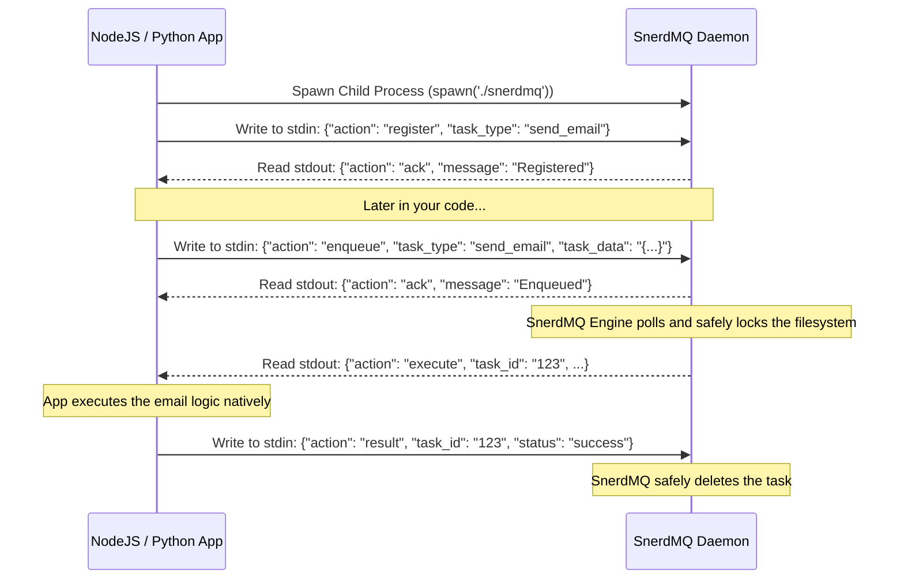

<div align="center">
  <h1>🚀 SnerdMQ</h1>
  <p>A lightning-fast, polyglot background job queue daemon powered by Rust.</p>

  [](https://crates.io/crates/snerdmq)
  [](https://github.com/greyhands2/snerdmq/blob/main/LICENSE)
  [](https://github.com/greyhands2/snerdmq/actions)

</div>

`snerdmq` is a specialized, embedded sidecar daemon that handles all the complex logic of background job queues (polling, file locking, retries, dead-letter queues) in highly-optimized Rust, while letting you write the actual execution logic in **Node.js, Python, Go, or Java**.

It runs as a child process and communicates via incredibly simple JSON over standard I/O pipes.

## ✨ Features
- **Zero Networking**: No ports, no firewalls, no IP addresses to configure.
- **Polyglot Friendly**: Works natively with any language that can spawn a child process.
- **Bulletproof Durability**: Uses `fs3` OS-level file locking to ensure 100% ACID compliance and corruption-free storage.
- **Smart Retries**: Built-in exponential backoff and Dead Letter Queue (DLQ) support.
- **Microsecond Latency**: Built on Tokio for massive concurrency with zero CPU hogging.

## 📦 Installation

**Option 1: Cargo (For developers with Rust installed)**
```bash
cargo install snerdmq
```

**Option 2: Pre-compiled Binaries (For production servers)**
Simply download the appropriate binary for your OS from the [GitHub Releases](https://github.com/greyhands2/snerdmq/releases) page and place it in your project.

---

## ⚡ How it Works (The Architecture)

`snerdmq` runs alongside your application as a child process. You communicate with it by piping newline-delimited JSON strings into its `stdin` and reading its `stdout`.



## 🌍 Distributed Scaling (Kubernetes / EC2)

`snerdmq` is incredibly simple to run on a single machine. But what if you have 10 microservices running behind a load balancer?

By default, `snerdmq` stores its queue in a local file at `.snerdata/tasks/tasks.log`. 
To scale horizontally across multiple isolated servers, simply mount a **Shared Network Drive (like AWS EFS or an NFS volume)** to all of your servers and pass that shared path as a command-line argument when you spawn the daemon:

```bash
# All 10 servers point to the exact same shared file!
./snerdmq /mnt/aws-efs-shared-drive/snerd_tasks.log
```

Thanks to our native OS file locking (`flock`), if two servers try to enqueue or execute a task at the exact same millisecond, the Operating System will perfectly synchronize the lock, guaranteeing zero data corruption across your cluster!

## 🔧 Language SDKs (Coming Soon)
While you can communicate with `snerdmq` manually via standard I/O, official Thin Client SDKs are actively being developed for:
- [ ] Node.js / TypeScript
- [ ] Python
- [ ] Go

*Built with ❤️ for John Wick tier engineering.*
